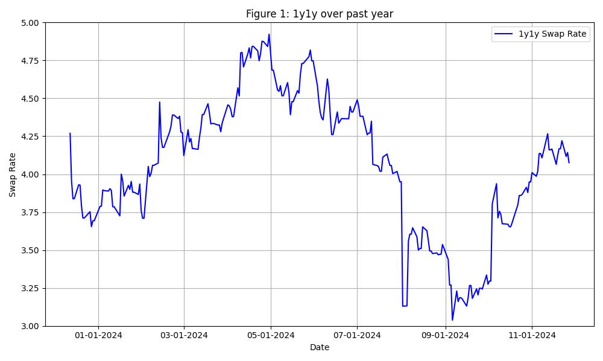
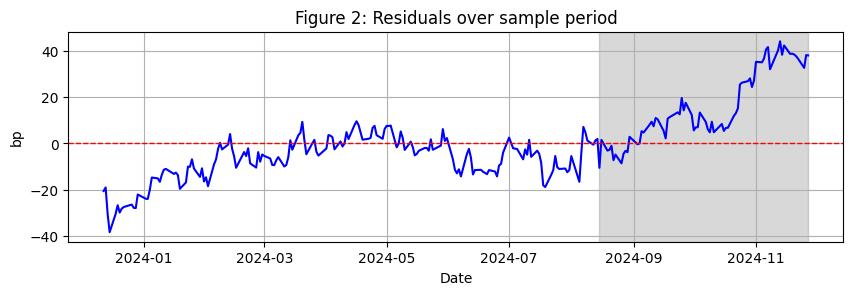

# UVAmacro.github.io

# Fair value analysis of the 2s10s curve 

In this note we consider a regression of the 2s/10s curve on the 1y1y swap rate, 5y5y breakeven rate and BoFAML MOVE Index. The sample period runs from 2023-12-06 to 2024-12-06. 

### Swap rates and the macro narrative: 2024 in retrospect

Figure 1 encapsulates the narrative volatility that has characterized this year: an OER-driven reflationary narrative at the beginning; followed by a streak of soft-landing optimism upon downside surprises in April’s NFP and June’s CPI; then hard-landing fears surrounding August’s shock NFP; and, finally, ‘no-landing’ concerns in anticipation of a reflationary Trump regime.  

### Regression analysis

Figure 2 shows a clear steepening of the 2s10s, relative to fair value, over the shaded sample. Indeed, over that sample, the curve outperforms its beta to the 1y1y swap rate (Figure 3).

---

*Feel free to share your thoughts in the comments below!*
