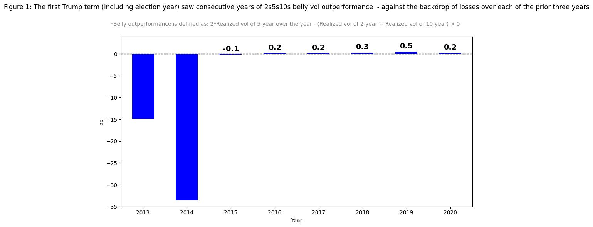
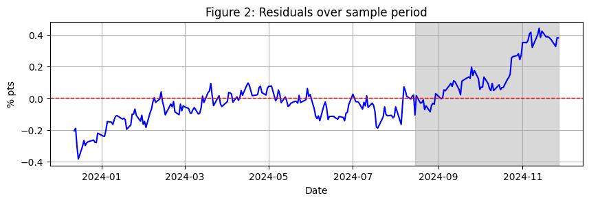
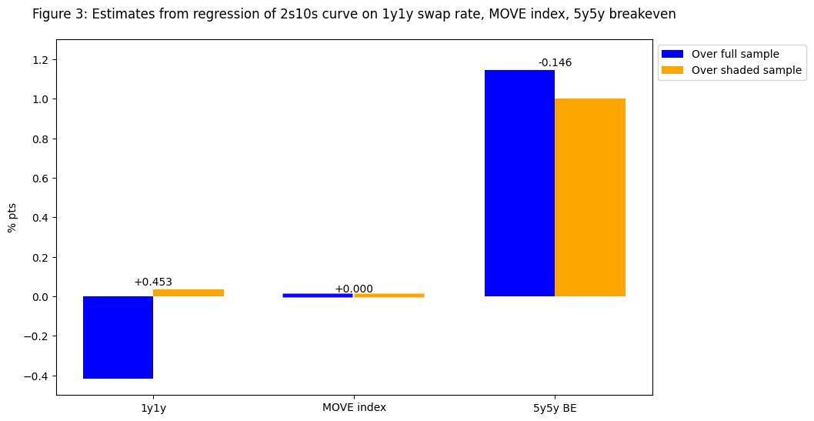
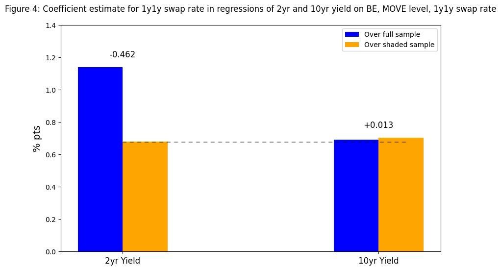
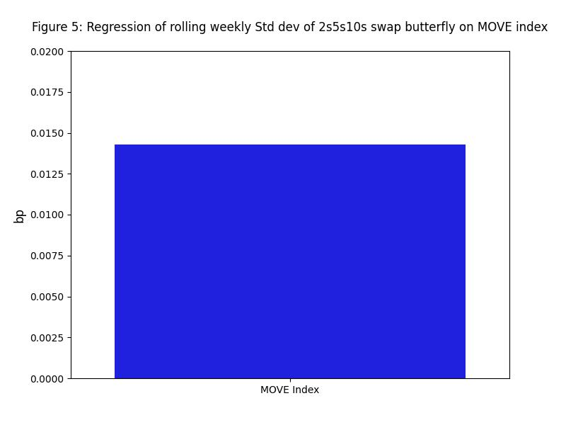
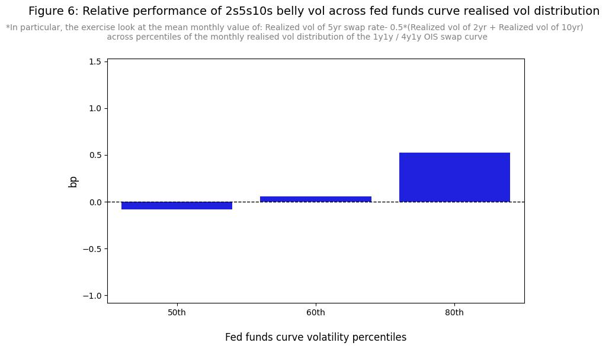

[View the code that generated this analysis (Python Juypter Notebooks)](https://github.com/ALILODHI-cloud/UVAmacro.github.io/blob/main/post_1/analysis.ipynb)

# Section 1: Fair value analysis of the 2s10s curve 

In this note we consider a regression of the 2s/10s curve on the 1y1y swap rate, 5y5y breakeven rate and BoFAML MOVE Index. The sample period runs from 2023-12-06 to 2024-12-06. 

### Swap rates and the macro narrative: 2024 in retrospect

Figure 1 encapsulates the narrative volatility that has characterized this year: an OER-driven reflationary narrative at the beginning; followed by a streak of soft-landing optimism upon downside surprises in April’s NFP and June’s CPI; then hard-landing fears surrounding August’s shock NFP; and, finally, ‘no-landing’ concerns in anticipation of a reflationary Trump regime.  

### Regression analysis

Figure 2 shows a clear steepening of the 2s10s, relative to fair value, over the shaded sample. Indeed, over that sample, the curve outperforms its beta to the 1y1y swap rate (Figure 3).

  

Increases in the 1y1y rate are associated with steepening over the shaded sample, but flattening over the full sample. The change in this beta can be decomposed into changes in the betas of the 2yr and 10yr yields, to the 1y1y rate, across the full and restricted samples (Figure 4).

The 2yr yield underperforms its beta to the 1y1y rate over the shaded sample; for the 10yr yield, the situation is one of outperformance. Additionally, increases in the 1y1y rate cause bear flattening over the full sample (left blue bar > right blue bar) but bear steepening (left yellow < right yellow) over the shaded sample.   

# Section 2: The 10s-20s-30s butterfly in high vol \ high term premia environments 

In this note we consider positioning for high vol \ high term premia environments using butterfly spreads. All regressions are over the past three years of data.

### Straddle swaption on a 2s5s10s swap butterfly

If indeed the 5yr yield captures the full spectrum of rate expectations (short, medium and long-run), then high vol environments should see large oscillations in the 5s relative to the 2s and 10s (in particular, in the quantity 5s – (10s+2s)/2) (Figure 6). This recommends a straddle swaption on a 2s5s10s butterfly swap (that is, buying both the right to enter the swap as a payer of the 5s, and the right to enter as a receiver of the 5s).

### Paying the 20s on a 10s20s30s UST butterfly  

High vol boosts demand for convexity, and thus for the 10s relative to the 20s. High term premia reduces demand for duration and thus lessens demand for the 20s relative to the 30s. Both forces should cause the 20s to cheapen relative to the 10s and 30s (Figure 5). This recommends being short the 20s on a 10s20s30s butterfly spread (and long the 10s and 30s).

 

