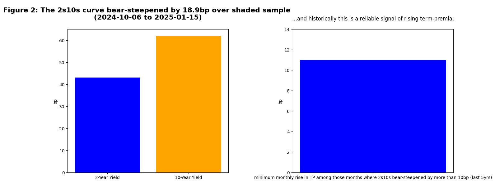
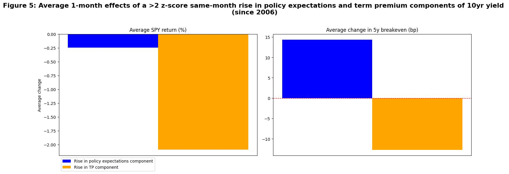

[View the code that generated this analysis (Python Juypter Notebooks)](https://github.com/ALILODHI-cloud/UVAmacro.github.io/blob/main/post_2/analysis.ipynb)

December payrolls poured fuel on what was already quite a marked rise in the 10y US yield, which is now up around 100bp since the September FOMC. 

We consider two questions: (1) what have been the catalysts of this rise?; and (2) when does it stop? 

# Section 1: Catalysts 

Figure 1 depicts the residuals of a regression of the 10y yield on its fundamental drivers over the past 5 years (1y1y ois rate %, 5y5y seasonally-adjusted breakevens %, and Fed balance sheet as a share of the US economy %). Much of the recent increase is in excess of what can be explained by fundamentals (the current residual is more than ~2 times the model standard error). The bear steepening of the 2s10s curve over this period suggests that rising term-premia has played a role (figure 2). A decomposition of the 10yr yield into policy path and term premium components confirms this (figure 3). Indeed, the shaded sample coincides with crystallisation of beliefs surrounding the likelihood of a red-sweep (and its eventual realisation). The probable extension of the TCJA under this scenario—entailing an estimated $400bn boost to the deficit for each of the next 10 fiscal years (JPM)—would seem to justify rising term premia. Also occurring during the shaded sample was the appointment of Scott Bessent to Treasury secretary, an anticipated consequence of which is a pivot towards longer-term issuance (away from the Yellen-era bias for bills). And this is not to mention the general air of uncertainty surrounding the new administration’s eventual policy concoction. 

(The idea is that bear-steepening does not make sense from a policy path pricing standpoint; if more tightening is expected in the short-run, then, if anything, less tightening should be expected in the medium-to-long run. That leaves term-premia as a major driving force of longer-term yields). 

# Section 2: Where does this end?

Large increases in the term premium appear to weigh on growth expectations via a negative feedback loop through risk assets; the same dynamic is not visible for large increases in policy pricing (figure 4). In fact, larger increases in the term premium are associated with sharper downturns in equities, growth expectations, and policy pricing (figure 5). (Regarding increases in the policy expectations component: the concurrent downturn in equities and upturn in 5y breakeven can perhaps be explained by the chain: growth optimism --> increase in policy expectations component --> downward pressure on equities).

Under our framework, the month-to-2025-01-10 increase in term premium has a z-score of ~1.49. Judging by our sample (2006 onwards) this should have been enough to apply some downward pressure on the 10yr yield over the last month (via its policy expectations component). Whether the sell-off soon abates, however, depends on how this force balances-off against an upwards trajectory in term premium. 

