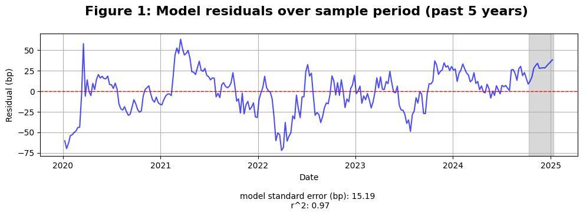

[View the code that generated this analysis (Python Juypter Notebooks)](https://github.com/ALILODHI-cloud/UVAmacro.github.io/blob/main/post_2/analysis.ipynb)

December payrolls poured fuel on what was already quite a marked rise in the 10yr yield, which is now up around 100bp since the September FOMC. 

We consider two questions: (1) what have been the catalysts of this rise?; and (2) when does it stop? 

# Section 1: Catalysts 

Figure 1 depicts the residuals of a regression of the 10yr on its fundamental drivers over the past 5 years (the 1y1y ois rate %, 5y5y seasonally-adjusted breakevens %, and Fed balance sheet as a share of the US economy %). Much of the recent increase is in excess of what can be explained by fundamentals (the current residual is more than ~2 times the model standard error). Concurrent bear steepening of the 2s10s curve suggests that rising term-premia has played a role (figure 2). This is confirmed by a decomposition of the 10yr into policy path and term premium components (figure 3). Indeed, the shaded sample coincides with crystallisation of beliefs surrounding the likelihood of a red-sweep (and its eventual realisation). The probable extension of the TCJA under this scenario—entailing an estimated $400bn boost to the deficit for each of the next 10 fiscal years (JPM)—would seem to justify rising term premium. Also occurring during the shaded sample was the appointment of Scott Bessent to Treasury secretary, an anticipated consequence of which is a pivot towards longer-term issuance (away from the Yellen-era bias for bills). Finally, the spectre of QT looms large, implying, as it does, the shift in demand towards more price-sensitive investors. And this is all not to mention the general air of uncertainty surrounding the new administration’s eventual policy concoction. 

# Section 2: Where does this end?

Sufficiently large increases in the term premium appear to weigh on growth expectations via a negative feedback loop running through risk assets (figure 4). The the same dynamic is not visible for large increases in policy pricing (there, the story is: growth optimism --> increase in policy expectations component --> downward pressure on equities) (figure 5). The underlying intuition is perhaps that sharp increase in term premia = sharp improvement in risk-reward characteristics of duration --> duration crowds out equities. 

Under our framework, the month-to-2025-01-10 increase in term premium has a z-score of ~1.49, which would qualify as insufficient in terms of applying downward pressure on the 10yr yield. 

# Conclusion

The current rise in yields has been driven principally by rising term premium. However, this increase appears insufficiently sharp as to  trigger the 'equity downturn --> growth pessimism --> dovish policy-pricing' chain of events.  
