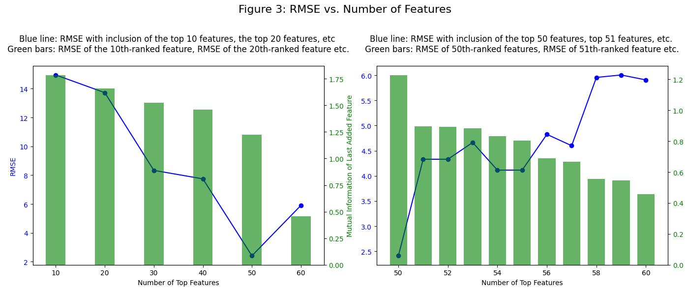
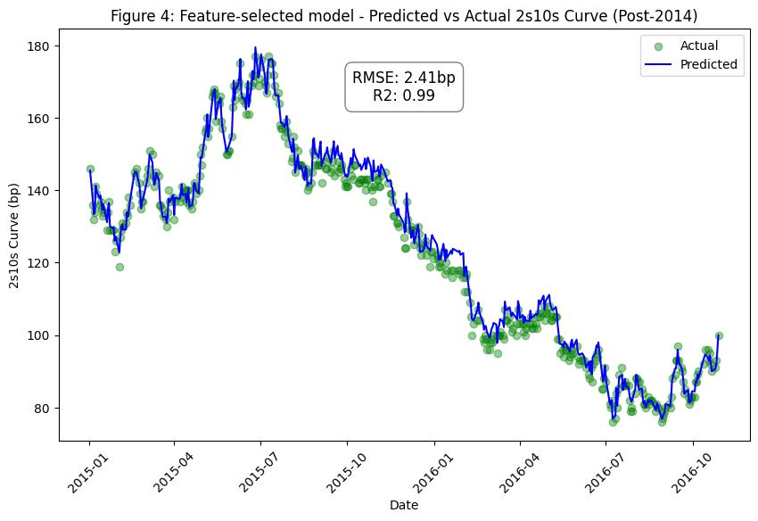

[View the code the generated this analysis (Python Juypter Notebooks)](https://github.com/ALILODHI-cloud/UVAmacro.github.io/blob/main/post_3/analysis.ipynb)

<head>
  
  
</head>

In prior posts, we have assumed the following structure for fair-value analysis of the 2s10s curve: 

$$
\text{2s10s curve} = \beta_0 + \beta_1 \times \text{1y1y OIS rate} + \beta_2 \times \text{5y5y breakeven rate} + \beta_3 \times \text{fed balance sheet as prop of US economy}
$$ 

In this post, we evaluate the out-of-sample performance of that model, and then attempt to improve upon it using feature-selection techniques borrowed from machine learning. 

**Section 1: Simple model performance** 

Having fit\trained the simple model on the 2006 start-2014 start sample, Figure 1 displays its performance on the 2014 - 2016 sample. Performance, as can be seen, is very poor. 

**Section 2: Linear regression + feature selection via mutual information** 

In this section, we retain a linear regression framework, but select regressors (‘features’) in a more algorithmic fashion. In particular, the feature utility metric ‘mutual information’ is deployed on a data set comprising 60 variables (figure 2). 

As a summary overview, given a prospective feature X and target Y, this technique computes a mutual information score according to:

$$
I(X; Y) = \sum_{x \in X} \sum_{y \in Y} p(x, y) \log \left( \frac{p(x, y)}{p(x) p(y)} \right)
$$

To gain some intuition, suppose X is a binary RV indicating whether a particular person used an umbrella on a given day. Suppose Y is a binary RV indicating whether it rained on a given day. 

Let our first observation be such that X=1, Y=1 (i.e. an umbrella was used and it rained). The summand resolves to 

$$
I(X; Y) = (\text{prop of obs in which X=1 and Y=1}) \times \log \left( \frac{(\text{prop of obs in which X=1 and Y=1})}{(\text{prop of obs in which X=1) (prop of obs in which y=1)}} \right)
$$

Because "prop of odds in which X=1" and "prop of odds in which Y=1" will both, naturally, be _basically_ equal to "prop of odds in which X=1 AND Y=1", the argument in the log term will be greater than 1, and thus the log term itself greater than 0. Therefore observation one will contribute positively to the MI score. Also, because "prop of obs in which X=1 and Y=1" is quite large, the positive contribution will be weighted quite heavily. The result is a large MI score. 

We will also, however, have cases where, say, (X=1, Y=0). The summand would in this case be:

$$
I(X; Y) = (\text{prop of obs in which X=1 and Y=0}) \times \log \left( \frac{(\text{prop of obs in which X=1 and Y=0})}{(\text{prop of obs in which X=1) (prop of obs in which y=0)}} \right)
$$

Intuitively, the numerator in the log term would be smaller than the denominator, and so the log would resolve to something less than zero. While this observation would thus detract from the MI score, it would do so in a way which is scaled by "prop of obs in which X=1 and Y=0" - which is to say, not by much ("prop of obs in which X=1 and Y=0" is likely very small).

Application of mutual information to our feature space produces the ranking displayed in Figure 2. It is notable that forward swap rates comprise the bulk of the highest-performing variables. 

**Section 3: Performance of the feature-selected model** 

When thinking about which variables to include as features in our model, we might consider starting with the top 10 (as ranked by MI), computing performance, then adding the next-best 10, computing performance, and so forth. When doing this, it is notable that the largest drop-offs in performance coincide with the largest drop-offs in MI score (Figure 3). This happens, presumably, because if a variable is uninformative about the 2s10s curve, then its inclusion is tantamount to forcing the model to learn a relationship which doesn't exist - that is, noise. 

In our case, inclusion of the **top 50** variables appears optimal. Thus our model is now:

$$\text{2s10s curve} = \beta_0 + \sum_{i=1}^{50} \beta_i \cdot X_{\text{feature with i-th highest MI score}}$$

This model sees vast improvements upon the simple model from earlier (Figure 4). 

**Conclusion**

Future extensions will entail translating this fair-value model into trading signals that can support a simple relative-value strategy. I will also attempt backtesting of some sort. 

