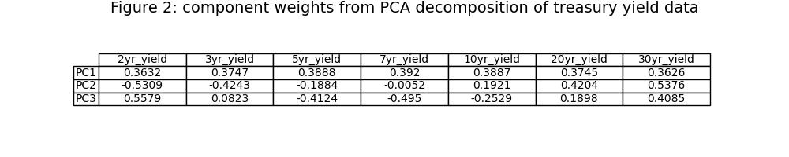

[View the code the generated this analysis (Python Juypter Notebooks)](https://github.com/ALILODHI-cloud/UVAmacro.github.io/blob/main/post_3/analysis.ipynb)

<head>
  
  
</head>

# Trading relative vol post Bowman and 2025 Q1 Treasury Refunding 

As has been well-documented, the past week saw a marked widening of swap spreads, with longer-tenor outperformance driving steepening across the spread curve. The catalyst was a relief of spot supply\funding concerns afforded by the following events:

  1. At the Treasury QFA it was said that: "Treasury anticipates maintaining nominal coupon and FRN auction sizes for
  at least the next several quarters." This was bullish relative to an anticipated terming-out.

  2. Governor Bowman said that "Where we can take proactive regulatory measures to ensure that primary dealers have adequate balance sheet       capacity to intermediate Treasury markets, we should do so. This could include amending the leverage ratio and G-SIB surcharge regulations
  for the largest U.S banks". The implied exemption of Treasuries from the leverage ratio calculation would boost bank demand.

  3. Secretary Bessent emphasized that "The president wants lower rates. He and I are focused on the 10-year Treasury and what is the yield     of that", further inspiring confidence in the stability of near-term duration supply.

This wave of relief should prove bearish for the realised vol of longer-tenor (e.g. 10yr) rates in the near-term. Yet the proposals that have driven this relief should, if realised, themselves prove supportive of longer-tenor, longer-run realised vol. For instance, prolonged reliance on bills means greater sensitivity of deficits to interest rates, and thus higher deficits in the event of upside rate outcomes (because interest expense is a sizeable portion of government expenses). As another example, deregulation would mean greater likelihood of adverse outcomes down the road. The result is a steepening of the vol surface between near-term and longer-term expiries for tenors such as the 10 and 30yrs. Buying, say, 2y10y straddles vs 6m10y straddles would be a way to position for this. 

(1)-(3) can collectively be considered a fundamentals-based argument for this trade. In this post, we advance a technicals-based one. First, a PCA decomposition of UST and swap rate data is performed to capture sentiment (e.g. optimism vs pessimism) around duration supply absorption\funding concerns. Then, we study behaviour of returns to the above-mentioned calendar spread (buying a 2y10y straddle vs a 6m10y straddle) following sharp increases in optimism around such issues.  

Below we provide a primer on PCA. 

>## PCA primer
>
>Suppose we have the following, two-dimensional, data:
>

>
>The orange arrows identify the most salient axes of variation in the data. In other words, most of the variance in our data is captured by the 'big X and Y - small X and Y'; the most common 'way' in which one observations differs from another, is by one having a large X and Y, and the other having a small X and Y. Then, clearly, the second most common 'way' is that one observation has a large X and small Y, whereas the other has a small X and large Y — this is described by the shorter arrow, which captures a smaller proportion of the variance than the longer arrow. Finally, note that the identified axes of variation are simply linear combinations of variables X and Y, where the sign of the weights on each variable reflect whether increases in that variable are associated with movements up, or down, the corresponding axis.  
>
>Principal Component Analysis (PCA) leverages a technique called 'Eigenvalue Decomposition' to identify arrows like the orange ones – that is, the major axes of variation in a given set of data. Consider Figure 2, for instance, which gives the output of a PCA decomposition on yield level data. 'PC1', or the first 'principal component', is the axis that captures most of the variation in the data. The weight ('loading') on each variable is positive, indicating that PC1 captures the variation that occurs due to some observations having across-the-board high yields, and others having across-the-board low yields. Thus we can term PC1 the 'level' component of our yield data. Looking next at PC2, we find that short and long-tenor yields are inversely-signed, indicating that this component has captured the variation ascribable to differences in the slope of the yield curve. Hence, PC2 is a 'slope' component. Similiar reasoning establishes that PC3 is best described as a 'curvature' component. 
>
>PC2, it turns out, tracks rather well with the ACM measure of 10yr term premium (Figure 2). The intuition is that increases in PC2 are associated with steepening across multiple curve pairs - a type of 'spacing out' of the yield curve - which should inuitively correlate well with increases in term premium. 

# PCA and swap spreads 

Figure 3 presents the first two components from a PCA on UST and OIS swap rate data. The first component is a level component. The second component, on the other hand, is a swap spread component. Note that larger values of that component are associated with narrower swap spreads, whereas smaller values with wider ones. Additionally, it can be observed that (10yr_OIS_swap loading - 10yr_yield loading) > (7yr_OIS_swap loading - 7yr_yield loading) > (5yr_OIS_swap loading - 5yr_yield loading) and so forth. This means that increases in PC2 are also associated with flattening of the swap spread curve (longer tenors narrow more than shorter ones). Therefore, increases in PC2 can effectively be interpreted as a rise in pessimism around spot supply absorption\funding issues (Figure 4).

**Section 2: Linear regression + feature selection via mutual information** 

In this section, we retain a linear regression framework, but select regressors (‘features’) in a more algorithmic fashion. In particular, the feature utility metric ‘mutual information’ is deployed on a data set comprising 60 variables (figure 2). 

As a summary overview, given a prospective feature X and target Y, this technique computes a mutual information score according to:

$$
I(X; Y) = \sum_{x \in X} \sum_{y \in Y} p(x, y) \log \left( \frac{p(x, y)}{p(x) p(y)} \right)
$$

To gain some intuition, suppose X is a binary RV indicating whether a particular person used an umbrella on a given day. Suppose Y is a binary RV indicating whether it rained on a given day. 

Let our first observation be such that X=1, Y=1 (i.e. an umbrella was used and it rained). The summand resolves to 

$$
I(X; Y) = (\text{prop of obs in which X=1 and Y=1}) \times \log \left( \frac{(\text{prop of obs in which X=1 and Y=1})}{(\text{prop of obs in which X=1) (prop of obs in which Y=1)}} \right)
$$

Because "prop of odds in which X=1" and "prop of odds in which Y=1" will both, naturally, be _basically_ equal to "prop of odds in which X=1 AND Y=1", the argument in the log term will be greater than 1, and thus the log term itself greater than 0. Therefore observation one will contribute positively to the MI score. Also, because "prop of obs in which X=1 and Y=1" is quite large, the positive contribution will be weighted quite heavily. The result is a large MI score. 

We will also, however, have cases where, say, (X=1, Y=0). The summand would in this case be:

$$
I(X; Y) = (\text{prop of obs in which X=1 and Y=0}) \times \log \left( \frac{(\text{prop of obs in which X=1 and Y=0})}{(\text{prop of obs in which X=1) (prop of obs in which Y=0)}} \right)
$$

Intuitively, the numerator in the log term would be smaller than the denominator, and so the log would resolve to something less than zero. While this observation would thus detract from the MI score, it would do so in a way which is scaled by "prop of obs in which X=1 and Y=0" - which is to say, not by much ("prop of obs in which X=1 and Y=0" is likely very small).

Application of mutual information to our feature space produces the ranking displayed in Figure 2. It is notable that forward swap rates comprise the bulk of the highest-performing variables. 

**Section 3: Performance of the feature-selected model** 

When thinking about which variables to include as features in our model, we might consider starting with the top 10 (as ranked by MI), computing performance, then adding the next-best 10, computing performance, and so forth. When doing this, it is notable that the largest drop-offs in performance coincide with the largest drop-offs in MI score (Figure 3). This happens, presumably, because if a variable is uninformative about the 2s10s curve, then its inclusion is tantamount to forcing the model to learn a relationship which doesn't exist - that is, noise. 

In our case, inclusion of the **top 50** variables appears optimal. Thus our model is now:

$$\text{2s10s curve} = \beta_0 + \sum_{i=1}^{50} \beta_i \cdot X_{\text{feature with i-th highest MI score}}$$

This model sees vast improvements upon the simple model from earlier (Figure 4). 

**Conclusion**

Future extensions will entail translating this fair-value model into trading signals that can support a simple relative-value strategy. I will also attempt backtesting of some sort. 

