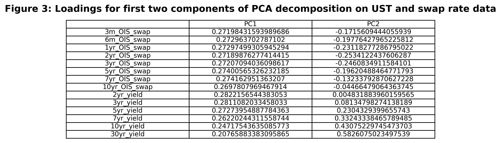
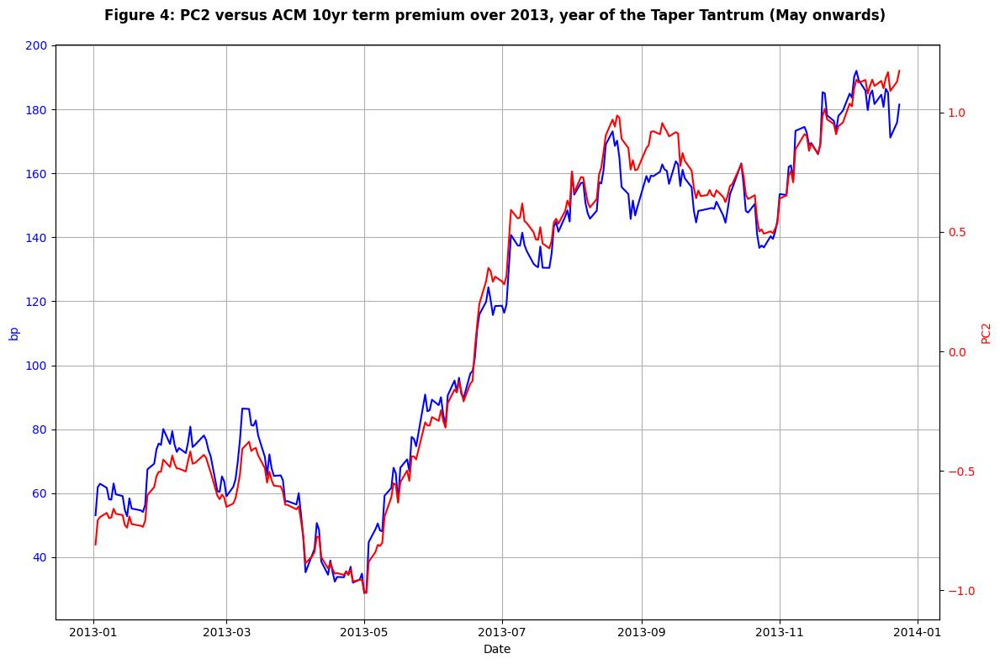

[View the code the generated this analysis (Python Juypter Notebooks)](https://github.com/ALILODHI-cloud/UVAmacro.github.io/blob/main/post_4/analysis.ipynb)

# Trading relative vol post Bowman and 2025 Q1 Treasury Refunding Announcement

> • The past week saw a widening of swap spreads, with longer-tenor outperformance driving steepening across the spread curve
> 
> • The Q1 Treasury QRFA and Governor Bowman's remarks on regulation drove relief of spot supply\funding concerns
> 
> • Historically, the distribution of returns to buying 2yr vol vs 10yr vol shifts upward following such episodes of relief 

\
As has been well-documented, the past week saw a widening of swap spreads, with longer-tenor outperformance driving steepening across the spread curve. The catalyst was relief of spot supply\funding concerns afforded by the following events:

  1. At the Treasury QRFA it was said that: "Treasury anticipates maintaining nominal coupon and FRN auction sizes for
  at least the next several quarters." This was bullish relative to an anticipated terming-out.

  2. Governor Bowman said that: "Where we can take proactive regulatory measures to ensure that primary dealers have adequate balance sheet       capacity to intermediate Treasury markets, we should do so. This could include amending the leverage ratio and G-SIB surcharge regulations
  for the largest U.S banks". The implied exemption of Treasuries from the leverage ratio calculation would boost bank demand.

  3. Secretary Bessent emphasized that: "The president wants lower rates. He and I are focused on the 10-year Treasury and what is the yield     of that", further inspiring confidence in the stability of near-term duration supply.

This wave of relief should prove bearish for the realised vol of longer-tenor (e.g. 10yr) rates in the near-term. Yet the proposals that have driven this relief should themselves prove supportive of realised vol in the long-term. For instance, prolonged reliance on bills means greater sensitivity of deficits to interest rates, and thus higher deficits in the event of upside rate outcomes (because interest expense is a sizeable portion of federal expenses). As another example, deregulation would mean greater likelihood of adverse outcomes down the road. The result would be a steepening of the vol surface along expiries for tenors such as the 10yr and 30yr. At the same time, the road is paved for attention to shift to policy-pricing matters - for instance a reassessement of the presumed dovish-skew of the Fed's reaction function. Putting these points together (lower realised vol of 10yr rate in near-term but not necessarily long-term + a refocus of attention on the 2yr) would imply a steepening of the vol surface along tenors for expiries such as the 6m. A structure like buying 6m2y straddles vs 6m10y straddles would thus be advisable. (See [post 1](Post_1/body.md) for a primer on swaption straddles).

(1)-(3) can collectively be considered a fundamentals-based argument for this trade. In this post, we advance a technicals-based one. First, a PCA decomposition of UST and swap rate data is performed to capture sentiment (e.g. optimism vs pessimism) around duration supply absorption/funding concerns. Then, we study behaviour of returns to the above-mentioned spread (buying a 6m2y straddle vs 6m10y straddle) following sharp improvements in that sentiment (i.e. increases in optimism).

Below we provide a primer on PCA. 

>### PCA primer
>
>Suppose we have the following, two-dimensional, data:
>

>
>The orange arrows identify the most salient axes of variation in the data. In other words, most of the variance in our data is captured by the 'big X and Y - small X and Y' axis; the most common 'way' in which two observations differ from one another, is by one having a large X and Y, and the other having a small X and Y. Then, clearly, the second most common 'way' is that one observation has a large X and small Y, whereas the other has a small X and large Y — this is described by the shorter arrow, which captures a smaller proportion of the variance than the longer arrow. Finally, note that the identified axes of variation are simply linear combinations of variables X and Y, where the sign of the weights on each variable reflect whether increases in that variable are associated with movements up, or down, the corresponding axis.  
>
>Principal Component Analysis (PCA) leverages a technique called 'Eigenvalue Decomposition' to identify arrows like the orange ones – that is, the major axes of variation in a given set of data. Consider Figure 2, for instance, which gives the output of a PCA decomposition on yield-level data. 'PC1', or the first 'principal component', is the axis that captures most of the variation in the data. The weight ('loading') on all variables is positive, indicating that PC1 captures the variation that occurs due to some observations having across-the-board high yields, and others having across-the-board low yields. Thus we can term PC1 the 'level' component of our data. Looking next at PC2, we find that short and long-tenor yields are inversely-signed, indicating that this component has captured the variation ascribable to differences in the slope of the yield curve. Hence, PC2 is a 'slope' component. Similiar reasoning establishes that PC3 is best described as a 'curvature' component. 
>
>PC2, it turns out, tracks rather well with the ACM measure of 10yr term premium (Figure 2). The intuition is that increases in PC2 are associated with steepening across multiple curve pairs - a type of 'spacing out' of the yield curve - which should inuitively correlate well with increases in term premium. 

## PCA and swap spreads 

Figure 3 presents the first two components from a PCA on UST and OIS swap rate data. The first component is a level component. The second component, on the other hand, is a swap spread component. Note that larger values of that component are associated with narrower swap spreads, whereas smaller values with wider ones. Additionally, it can be observed that (10yr_OIS_swap loading - 10yr_yield loading) > (7yr_OIS_swap loading - 7yr_yield loading) > (5yr_OIS_swap loading - 5yr_yield loading) and so forth. This means that increases in PC2 are also associated with flattening of the swap spread curve (longer tenors narrow more than shorter ones). Therefore, increases in PC2 can effectively be interpreted as increases in pessimism around spot supply absorption/funding issues; decreases can be interpreted as increases in optimism (Figure 4).

We can proxy returns to the 6m2y vs 6m10y spread, over any given period, by -(realised vol 10yr swap rate - realised vol 2yr swap rate). Figure 5 looks at the distribution of this quantity over the 6 months following decreases in PC2 over different horizons. For instance, the blue bar in the 5-day horizon plot shows the distribution of returns following 5-day over 5-day decreases in PC2 that were between 1 and 2 2yr-rolling standard deviations (of 5-day changes) away from the 2yr-rolling mean (of 5-day changes). It is both the case that (1) 'large' shocks entail fatter right tails (that is, more upside to the trade); and (2) 'large' shocks entail higher mean returns. The intuition is that sharp decrease in PC2 --> relief-driven compression of distribution of outcomes around 10yr rate --> greater underperformance of 10yr realised vol vs 2yr realised vol. 

## Conclusion 

The Treasury QRFA and Bowman's remarks on deregulation are bearish for near-term 10yr vol but somewhat bullish for longer-term vol in that same rate. Also, both events are bullish for near-term 2yr vol. As such, buying a 6m2y straddle vs selling a 6m10y straddle is advisable. Historically the distribution of returns to this trade shifts up following waves of supply absorption/funding relief. 

**Ali Lodhi**

