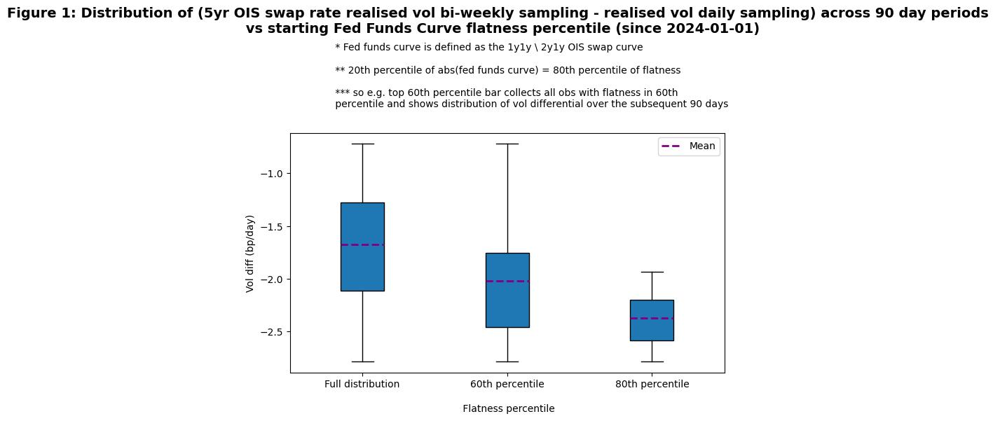

[View the code the generated this analysis (Python Juypter Notebooks)](https://github.com/ALILODHI-cloud/UVAmacro.github.io/blob/main/post_5/analysis.ipynb)

# Derivative strategy for a Fed on hold: a hit straight to the Gamma

Today's FOMC meeting is thought to have ushered in a Fed 'on-hold'. But what does this mean? The following is one way to think about this:

**Regime 1 (pro-active Fed)** 'Show me a reason to stand pat; otherwise, I cut (or hike, if in a hiking cycle)' 

**Regime 2 (on-hold Fed)** 'Show me a reason to cut; otherwise, I stand pat'

For a pro-active, cutting-cycle Fed, the burden of proof is borne by proponents of inaction; for an on-hold Fed, it is borne by proponents of further easing. We appear now squarely in Regime 2. 

There is also reason to think that Regime 2 is characterized by more mean reversion, of rates, than is Regime 1. To see this, imagine that we are in a Regime 1 cutting cycle. Upon a bearish surprise (e.g. upside inflation or growth) the dovish asymmetry of the Fed reaction function (implied by the cutting-cycle) places an effective cap on how high rates will reprice, encouraging mean reversion. Upon bullish surprises, however, this same dovishness means the absence of a floor on how low rates will reprice (at least within a suitably large range). Now imagine instead a Regime 2 cutting-cycle. Upon a bearish surpise, the dovish assymetry --> effective cap on how high rates will reprice, encouraging mean reversion. That part is shared in common with Regime 1. But now, upon a bullish surprise, uncertainty surrounding the Fed's evidential standards places an effective floor on how low rates will reprice, also encouraging mean reversion. So we can see that Regime 2 is characterized by range-boundedness on both the downside _and_ upside - whereas Regime 1 has it only on the upside. Therefore, we should expect to see a greater degree of mean reversion in Regime 2. 

We quantify the extent of mean reversion in a given period x by: (realised vol in x based on _weekly sampling_ - realised vol based on _daily sampling._). If for instance this quantity is very negative, that means intra-week moves tend to cancel out, so that each week ends close to where it started (or at least closer to where it started than would have been suggested by some of its intra-week moves). Figure 1 shows the distribution of this quantity for 90-day periods depending on the relative flatness of the Fed Funds curve on the period's first observation. So for instance the right-most plot shows the distribution of this quantity across 90-day periods which are such that their first observation had an abs(Fed Funds Curve) value in the 80th percentile of flatness. 

What can be seen is a clear downwards-shift in mass as one moves rightwards across the distributions. This suggests a flatter initial curve is associated with a greater degree of mean reversion over the course of the period. 

## Strategy implications 

The main implication is that a Fed-on-hold is bearish for Gamma. Below, we provide a brief primer on Gamma.

> ### Primer: Gamma and delta hedging 
>
> Gamma refers to the rate of change of a swaption's delta with respect to the underlying rate. So if a payer swaption's delta increases by 1 when the underlying increases by 1bp, gamma is 1. The important fact is that gamma is typically positive, which means that, again for a payer swaption, each bp increase in the underlying rate induces a progressively greater appreciation in the position's value. A long, or _bullish Gamma_ position, is a position which benefits from this dynamic. Clearly, a long payer swaption (where one buys a payer swaption) is one such position, whereas a short payer swaption (where one sells a payer swaption) is not. The latter would instead be classified as a _bearish gamma_ position. In that position, as the underlying rate moves against you (that is, at it increases) the value of the instrument you have sold increases at a progressively faster pace. This is clearly not to your advantage.
>
> In regard to delta-hedging, take the example of a short payer swaption. Say the underlying rate moves upwards, and delta increases to $5 (from a starting point of 0). To restore delta to 0, you assemble a portfolio of long payer swaptions such that were the underlying rate to increase by another bp, the -$5 depreciation of your short payer swaption would be offset exactly by a +$5 appreciation of your long payer portfolio. (The equity version of this is a perhaps a bit clearer. If you are long a call with a delta of $5, then you would short 5 units of the underlying stock, so that a unit increase (decrease) in the stock's price would mean +$5 (-$5) on the long call and a collective -(5 x 1$) (+[5 x 1$]) on the short positions).

So to return, why is a Fed-on-hold bearish for Gamma? Because of the heightened degree of mean-reversion. Take the example of a short payer swaption. Increases in the underlying rate might, say, cause the delta to jump from 0 to 5 to 8, but relative to a case with less mean reversion, we would expect the sequence of increases to terminate sooner. In that case, the rate would subsequently fall, causing delta to retrace to something smaller. Not only are we better-off (compared to the limited mean reversion scenario) because our delta is now lower, but also because the 'pain' of that high delta (8) was never actually realised (because the subsequent rate movement was a decrease). All this is good for our short payer swaption, because it imposes an upper bound on how much the swaption can appreciate. 

Another consequence of mean reversion is that an investor can afford to delta-hedge less frequently. If the delta jumps from 0 to 5, but there is a strong likelihood the rate, and thus delta, will fall back down, delta hedgeing is something that can be gone without (at least for the meanwhile). This boosts the profitably of a short-gamma position. 

## Conclusion 

A Fed-on-hold appears to entail a greater degree of mean reversion, which renders short-gamma positioning advisable. 

